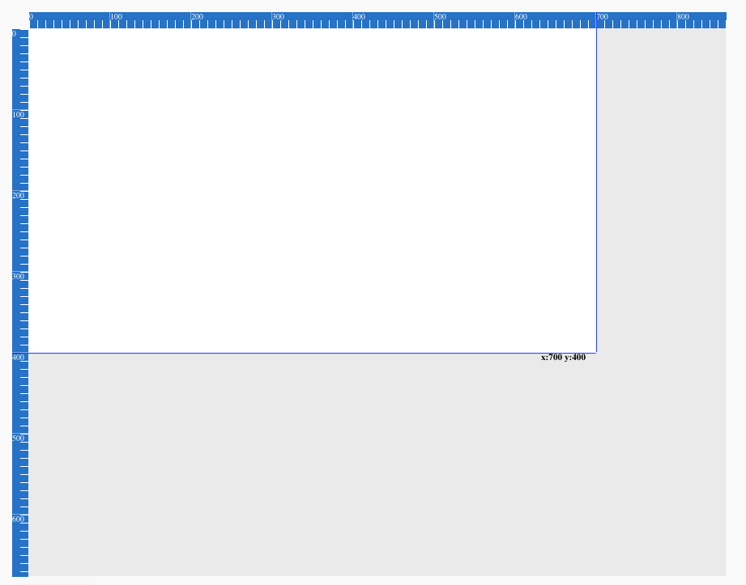

# zap-kit

> react component library

> Zap-kit is a collection of widgets for the html canvas. 
>  * Components
>     * [Ruler](#ruler-component)

[](https://www.npmjs.com/package/zap-kit) [](https://standardjs.com)

## Install

```bash
npm install --save zap-kit
```


## Usage

### Ruler Component

```jsx
import { Ruler } from 'zap-kit'
export default class RulerContainer extends Component {
  constructor(props) {
    super(props)
    this.refContainer = React.createRef()
    this.state = {
      container: null
    }
  }
  componentDidMount () {
    this.setState({
      container: this.refContainer
    })
  }
  render () {
    return (
      <div style={{
          height: '100%',
          width: '100%'
        }}
        ref={ref => this.refContainer = ref}
      >
        <Ruler refContainer={this.state.container}>

          <div className='display-panel' style={{ backgroundColor: 'red', height: '100%' }}>
            Display Content
          </div>
        </Ruler>
      </div>
    )
  }
}
```

## License

MIT © [cpt-chewieeee](https://github.com/cpt-chewieeee)
